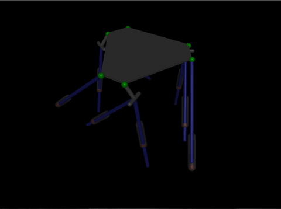
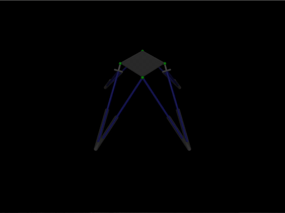
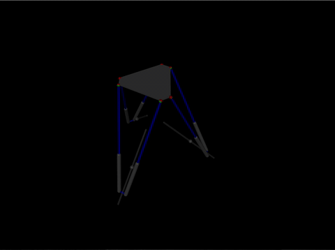
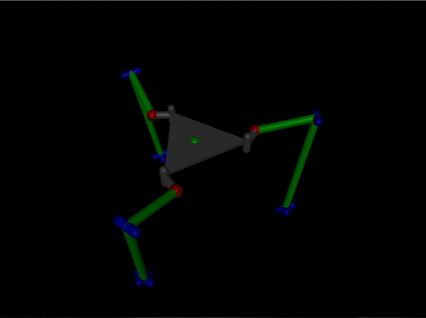
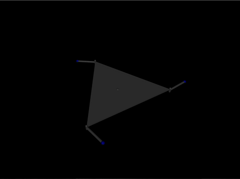
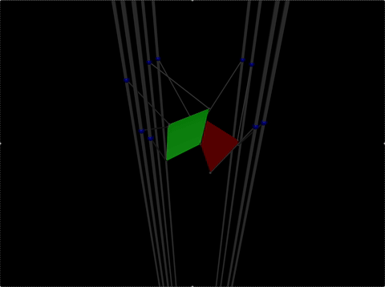

# SE3-RPKM

`SE3-RPKM` is a collection of spatial (DOF >= 6) redundant parallel kinematic machines (RPKMs) with differentiable Lie group kinematics in `JAX`. The repo also includes redundancy-resolution examples and `MuJoCo`/`MJX` simulations.

## Highlights

- Lie group modeling for $\mathrm{SE}(3)$ and related redundant structures, built on [jaxlie](https://github.com/brentyi/jaxlie).
- Differentiable kinematics suitable for optimization and learning.
- Ready-to-run examples with teleoperation utilities.

## Installation

### Minimal

```bash
pip install git+https://github.com/EzekielDaun/se3-rpkm.git
```

### Development & Examples

This project uses [`Pixi`](https://pixi.sh/) as the development package manager.

Clone this repository and install all dependencies:

```bash
git clone https://github.com/EzekielDaun/se3-rpkm.git && cd se3-rpkm
pixi install --all
```

## Run Examples

1. Install with `Pixi`: `pixi install --all`.
2. Start a twist publisher in a separate terminal:
   - `pixi run keyboard-twist-publisher`
   - `pixi run gamepad-twist-publisher`
3. Run a `MuJoCo` example from the supported list below, for example:
   - `pixi run se3so23-stewart`

## Supported RPKMs

### Redundant Stewart Platforms

- [^1] $\mathrm{SE}(3) \times \mathrm{SO}(2)^3$ `pixi run se3so23-stewart`
  
- [^2] $\mathrm{SE}(3) \times \mathrm{SO}(2)^2$ `pixi run se3so22-stewart`
  
- [^3] $\mathrm{SE}(3) \times \mathbb{R}^3$ `pixi run se3r3-stewart`
  

### 3-SR Platforms $(\mathrm{SE}(3) \times \mathrm{SO}(2)^3)$

- [^4] 3-(R(RR-RRR)SR) `pixi run se3so23-sr-platform-rrr-serial`
  
- [^5] 3-PPPSR `pixi run se3so23-sr-platform-basic-continuous`
  

### Miscellaneous

- [^6] 5-PSS-S-4PSS $(\mathrm{SE}(3) \times \mathrm{SO}(3))$ `pixi run se3so3-5pss-s-4pss`
  

[^1]: https://doi.org/10.1109/TRO.2016.2516025
[^2]: https://doi.org/10.1016/j.mechmachtheory.2022.105015
[^3]: https://doi.org/10.3390/act12030120
[^4]: https://doi.org/10.1109/TRO.2020.3043723
[^5]: https://doi.org/10.1007/978-3-031-95489-4_18
[^6]: https://doi.org/10.1007/978-3-031-95489-4_10

## Build Your Own RPKM

Define an implicit kinematic constraint function that maps the extended task variables (i.e., $\mathrm{SE}(3)$ pose plus redundancy) and joint variables to zero: $f(x, q) = \mathbf{0}$.

Implement this function in Python and override the [abstract method](./src/se3_rpkm/lie_group_kinematics.py#L36) with `pytree` data structures. Tangent space Jacobians are then computed automatically.
